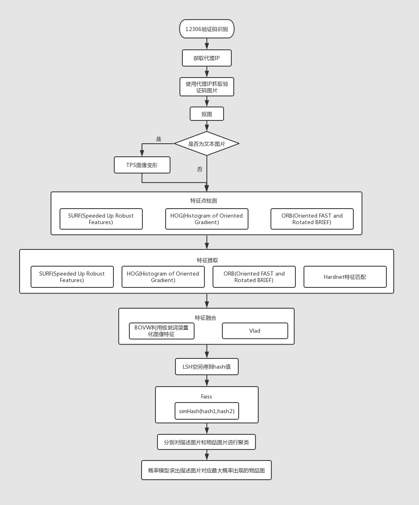

# 12306验证码识别

## 项目介绍
识别12306网页登录验证码

## 项目依赖
首先获取爬虫代理，框架和方法引用自 [proxy_pool](https://github.com/novioleo/proxy_pool)，
为了更方便的更改源码，这里直接下载了 [LSHash](https://github.com/kayzhu/LSHash)。
以及使用了[HardNet](https://github.com/DagnyT/hardnet)进行特征提取，
使用[VLAD](https://github.com/jorjasso/VLAD)进行特征融合。

## 思路


## how to run
```bash
git clone --recurse-submodules https://github.com/tearsl/12306_captcha_recognize
cd 12306_captcha_recognize/Docker
# 如果没有docker-compose需要预先安装docker-compose
# pip install docker-compose
# 第一次运行需要添加--build
docker-compose up # --build
```
启动代理ip池之后，运行crawler，为了避免使用多进程，减少代码复杂程度，想要增加爬虫的并发数直接运行多个即可。

将图片保存到本地之后，运行`python image_cutout.py /path/to/pics/folder`，会在图片所在的文件夹同级目录新建一个文件夹，
以及生成一个映射文件。装载切图后的结果。


## Contributors
[Novio](https://github.com/novioleo)  
